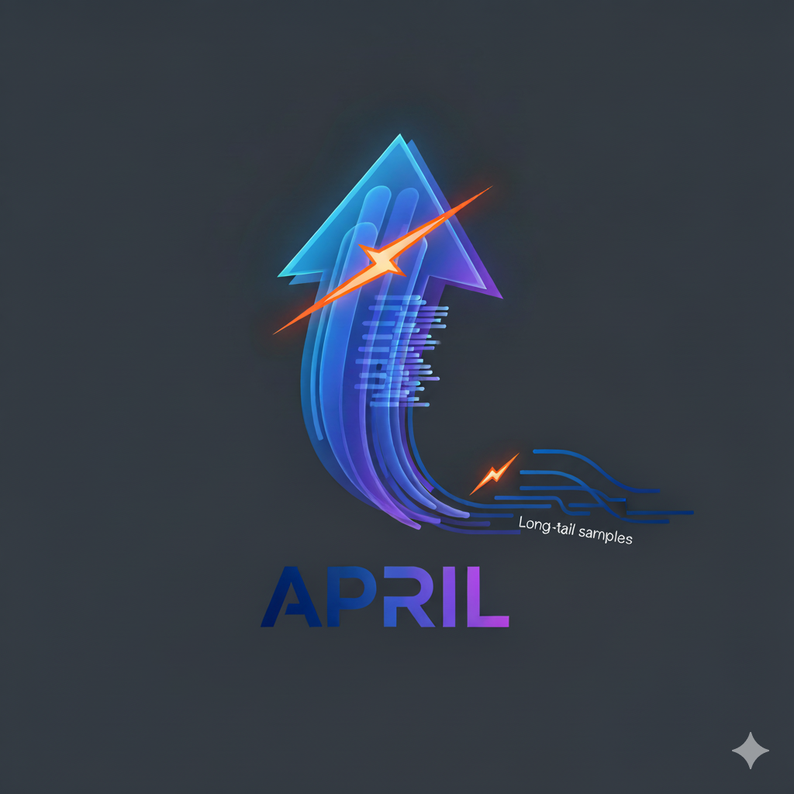
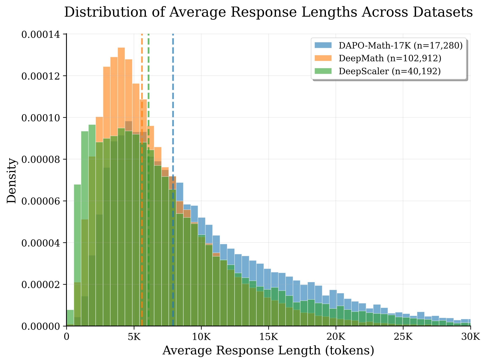
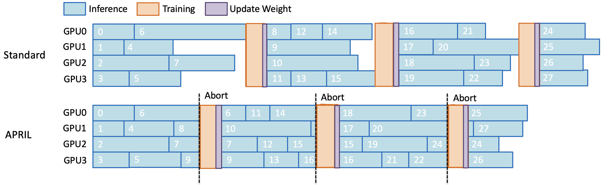
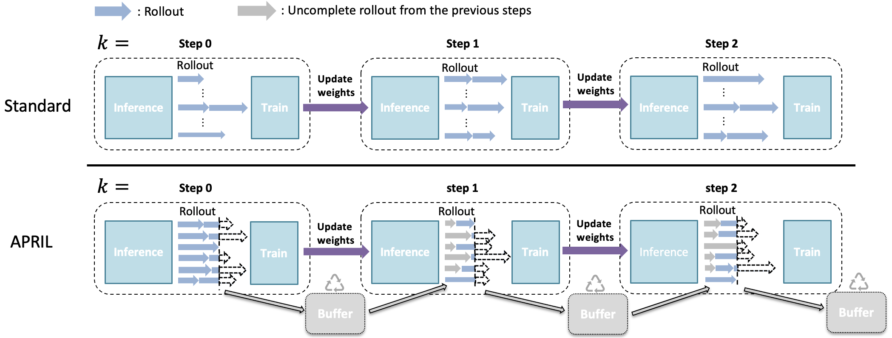
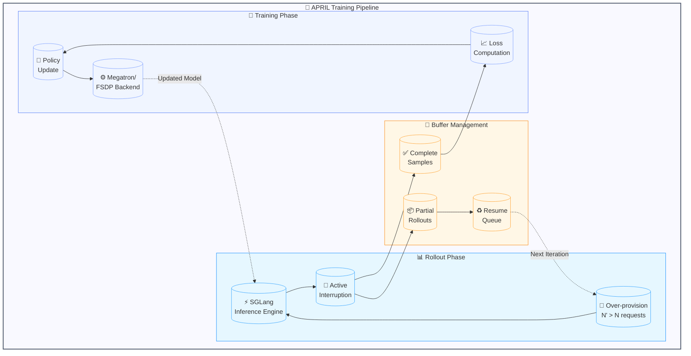

<div align="center">
  

  # APRIL: Active Partial Rollouts in Reinforcement Learning

  **Accelerating LLM Training by Taming Long-tail Generation**

  [](https://opensource.org/licenses/Apache-2.0)
  [](https://www.python.org/downloads/)
  [](https://pytorch.org/)
  [](https://deepwiki.com/RLsys-Foundation/APRIL?tab=readme-ov-file)

</div>

## 🚀 Overview

**APRIL** (Active Partial Rollouts) is a compute-efficient method to accelerate rollout generation in reinforcement learning training for Large Language Models (LLMs). By addressing the critical "long-tail" problem in RL training where a few samples with exceptionally long responses cause the entire batch to stall, APRIL delivers:

- **20-35% improvement** in rollout throughput
- **2-5% higher** final model accuracy
- **Faster convergence** during training
- **Hardware agnostic** - supports both NVIDIA and AMD GPUs

### The Problem: Long-tail Generation Bottleneck

In on-policy RL training (RLHF/GRPO/DAPO), the rollout phase dominates runtime, typically accounting for **over 90%** of total training time. Due to the highly variable response lengths across samples, synchronous training paradigms suffer from severe GPU underutilization as faster-generating workers sit idle waiting for the longest-running instances to complete.




### Our Solution: Active Partial Rollouts

APRIL revolutionizes rollout efficiency through an innovative mechanism:

1. **Over-provisioning**: Deliberately initiate more rollout requests than needed (N' > N)
2. **Active interruption**: Once the target batch size is reached, actively stop remaining unfinished rollouts
3. **Intelligent recycling**: Store partial results in a buffer and resume generation in the next iteration
4. **Seamless integration**: Works with existing RL frameworks without modifying inference kernels



## ✨ Key Features

- **🔥 Plug-and-play**: Enable with just two command-line flags (`--partial-rollout` and `--over-sampling-batch-size`)
- **🎯 Algorithm-agnostic**: Compatible with GRPO, DAPO, GSPO, and other popular RL algorithms
- **🏗️ Framework-ready**: Already integrated into [slime](https://github.com/THUDM/slime) framework
- **⚡ System-level optimization**: Operates at the scheduling layer, complementary to kernel-level optimizations
- **🔧 Production-tested**: Evaluated on multiple LLMs including DeepSeek-R1, Qwen3, and GLM-4

## 🛠️ Installation

### Quick Start with Docker

- AMD Docker Image
```
$DOCKER_IMG=rlsys/april:AMD_exp_docker_image
```
More detail, please refer to [AMD Dockerfile]().

- NV Docker Image
```
$DOCKER_IMG=rlsys/april:NV_exp_docker_image
```
More detail, please refer to [NVIDIA Dockerfile]().

#### Launch Docker Image:
```bash
docker run --rm \
    --gpus all \
    --ipc=host \
    --shm-size=16g \
    --ulimit memlock=-1 \
    --ulimit stack=67108864 \
    -it $DOCKER_IMG \
    /bin/bash
```

<!--
rlsys/slime:slime_ubuntu22.04_rocm6.3.4-patch-numa-patch_sglang0.4.9_megatron-patch_ray2.47.1_apex_torch-memory-saver0.0.8-patch-vim 
-->

### Install APRIL

```bash
git clone https://github.com/RLsys-Foundation/APRIL.git
cd APRIL
pip install -e .
```

## 🚦 Quick Start

### Basic Usage

Run a training example with APRIL enabled:

```bash
# Example: Qwen3-4B with DAPO
bash scripts/partial_rollout/qwen/grpo/run-qwen3-4B-dapo-partial.sh
```

### Key Parameters

```python
# Enable APRIL optimization
--partial-rollout

# Set over-sampling batch size (should be > rollout_batch_size)
--over-sampling-batch-size 64  # e.g., 2x the rollout_batch_size

# Standard rollout batch size
--rollout-batch-size 32
```

### Advanced Configuration

For detailed parameter explanations, see [arguments.py](./slime/utils/arguments.py).
## 📊 Performance Results

### Throughput Improvements

| Dataset       | Model    | Algorithm | Throughput Gain | Accuracy Improvement |
|---------------|----------|-----------|-----------------|---------------------|
| DAPO-Math-17k | Qwen3-4B | DAPO      | **+17%**       | +2.3%              |
| DeepScaleR    | Qwen3-4B | GRPO      | **+21%**       | +3.1%              |
| DeepMath-103K | Qwen3-4B | GSPO      | **+35%**       | +4.7%              |
| Agent Tasks   | DeepSeek-1.5B | GRPO  | **+23%**       | +2.8%              |

### Convergence Analysis


APRIL not only improves training efficiency but also achieves:
- **Faster convergence**: Reaches target accuracy 15-20% faster
- **Higher final accuracy**: 2-5% improvement in final model performance
- **Stable training**: No additional instability despite partial off-policy samples

## 🏗️ Architecture

### System Design



### Core Components

| Component | Path | Description |
|-----------|------|-------------|
| **Rollout Engine** | `slime/rollout/sglang_example.py` | Manages generation with active interruption |
| **Buffer System** | `slime/ray/buffer.py` | Stores and prioritizes partial rollouts |
| **Scheduler** | `slime/ray/rollout.py` | Orchestrates over-sampling and batch management |
| **Training Backend** | `slime/backends/` | Supports both Megatron and FSDP |

## ❓ FAQ

### Q: Does APRIL affect training stability?

While APRIL introduces ~40% off-policy tokens per iteration, extensive experiments show:
- No significant training instability
- Improved final model accuracy
- Consistent convergence patterns

> **Note**: For extremely long sequences (e.g., multi-turn agent tasks), additional validation may be needed.

### Q: Is APRIL compatible with other optimizations?

Yes! APRIL operates at the **system scheduling layer** and is fully compatible with:
- Kernel optimizations (FlashAttention, continuous batching)
- Inference engines (vLLM, SGLang, TensorRT-LLM)
- Speculative decoding techniques
- Model parallelism strategies

### Q: What hardware is supported?

APRIL is hardware-agnostic and tested on:
- **NVIDIA GPUs**: H100
- **AMD GPUs**: MI300X/MI325

## 📁 Repository Structure

```
APRIL/
├── imgs/                           # Documentation images
│   ├── APRIL.png                  # Project logo
│   └── partial_scheduling.png     # Architecture diagrams
├── scripts/
│   └── partial_rollout/           # Training scripts
│       ├── deepseek/              # DeepSeek model experiments
│       ├── qwen/                  # Qwen model experiments
│       └── README.md              # Script documentation
├── slime/                         # Core framework
│   ├── backends/                  # Training backends
│   │   ├── fsdp_utils/           # FSDP implementation
│   │   └── megatron_utils/       # Megatron-LM support
│   ├── rollout/
│   │   ├── sglang_example.py    # Core rollout implementation
│   │   └── rm_hub/               # Reward model integrations
│   ├── ray/                      # Distributed orchestration
│   │   ├── buffer.py             # Partial rollout buffer
│   │   └── rollout.py            # Rollout scheduling
│   └── utils/                    # Utilities and helpers
├── docs/                         # Documentation
│   ├── en/                       # English docs
│   └── zh/                       # Chinese docs
└── tools/                        # Model conversion utilities
```

## 🔬 Technical Details

### How APRIL Works

1. **Over-provisioning Phase**: Request N' = αN rollouts (α typically 1.5-2.0)
2. **Active Monitoring**: Track completion status across all workers
3. **Intelligent Interruption**: Send abort signal when N samples complete
4. **Buffer Management**: Store partial results with generation state
5. **Seamless Resumption**: Continue partial rollouts in next iteration

### Integration with Existing Frameworks

APRIL is designed as a drop-in enhancement for existing RL training pipelines:
- **Minimal code changes**: Enable with command-line flags
- **Framework agnostic**: Works with OpenRLHF, verl, Areal, slime
- **Automatic optimization**: Self-tuning based on workload characteristics

## 📚 Citation

If you use APRIL in your research, please cite our paper:

```bibtex
@misc{zhou2025aprilactivepartialrollouts,
      title={APRIL: Active Partial Rollouts in Reinforcement Learning to Tame Long-tail Generation},
      author={Yuzhen Zhou and Jiajun Li and Yusheng Su and Gowtham Ramesh and Zilin Zhu and Xiang Long and Chenyang Zhao and Jin Pan and Xiaodong Yu and Ze Wang and Kangrui Du and Jialian Wu and Ximeng Sun and Jiang Liu and Qiaolin Yu and Hao Chen and Zicheng Liu and Emad Barsoum},
      year={2025},
      eprint={2509.18521},
      archivePrefix={arXiv},
      primaryClass={cs.LG},
      url={https://arxiv.org/abs/2509.18521},
}
```

## 🤝 Contributing

We welcome contributions! Please see our [Contributing Guide](CONTRIBUTING.md) for details.

## 📄 License

This project is licensed under the Apache License 2.0 - see the [LICENSE](LICENSE) file for details.

## 🙏 Acknowledgments

APRIL builds upon the excellent work of:
- [slime](https://github.com/THUDM/slime) - The base RL training framework
- [SGLang](https://github.com/sgl-project/sglang) - High-performance inference backend
- [Megatron-LM](https://github.com/NVIDIA/Megatron-LM) - Distributed training backend

## 📬 Contact

For questions and support:
- Open an issue on [GitHub](https://github.com/RLsys-Foundation/APRIL/issues)

---

<div align="center">
  <sub>Built with ❤️ by the RLsys Foundation Team</sub>
</div>
